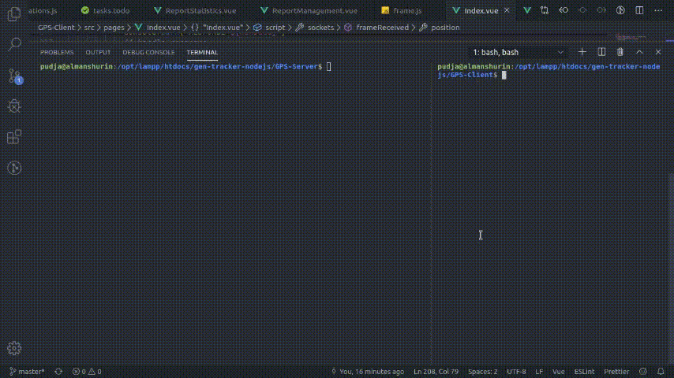

# GEN-Tracker

- GEN Server & GEN Client should be executed from same machine (the server).

  Or change the **socket.address** in **GEN-Client/src/components/js/config.js**
- Use **fake generator** feature if you don't have the IoT Device ready

## GEN-Tracker Server

- Use TCP server *(for bi-directional communication with IOT-Devices)*.

  Receive HEX data, then convert it to HEX string.
- Use socket.io-server *(for bi-directional communication with GEN-Client)*.

  Act as bridge between IoT devices and Web-Client.
- Run: **nodemon app.js**
